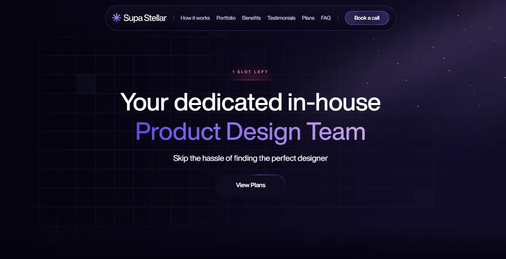

**渐变**作为一种自由度和可玩性极高的设计手法，不受限于任何特定风格，可以通过两种甚至多种颜色的过渡设计，创造出令人惊艳的视觉效果。

**文字是网页中最重要的元素之一。如何将文字设计得既美观又富有吸引力，是设计师们不断探索的重要课题。**
在文字上应用渐变效果，不仅能为文字增添奇妙的色彩层次和触觉反射，或者提升质感，甚至可以让文字变得生动有趣。尤其在品牌构建中，文字渐变可以巧妙搭配品牌色，制作出细腻的效果，保持统一的品牌语言，增强视觉辨识度。

## 一、文字渐变的设计案例

**下面是我创作的一些文字渐变案例。可以通过 CodePen 体验或者直接使用到你的项目当中**

CodePen地址：[https://codepen.io/ricoui/pen/GggLJzP](https://codepen.io/ricoui/pen/GggLJzP)

<p class="codepen" data-height="300" data-theme-id="dark" data-default-tab="html,result" data-slug-hash="GggLJzP" data-pen-title="Text Gradient 001" data-user="ricoui" style="height: 300px; box-sizing: border-box; display: flex; align-items: center; justify-content: center; border: 2px solid; margin: 1em 0; padding: 1em;">
  See the Pen<a href="https://codepen.io/ricoui/pen/GggLJzP">
  Text Gradient 001</a> by ricochan (<a href="https://codepen.io/ricoui">@ricoui</a>)
  on <a href="https://codepen.io">CodePen</a>.
</p>
<script async src="https://public.codepenassets.com/embed/index.js"></script>


## 二、网站优秀案例：

#### 1. **Dimension**

[Dimension](https://www.dimension.dev/)


```html
<h1 class="text-gradient-dimension01">
Dimension is the new 
</h1>
<h1 class="text-gradient-dimension02">
standard for collaboration
</h1>

<style>
.text-gradient-dimension01 {
    background-image: linear-gradient(180deg, rgba(240, 238, 249, .8) 0%, #e2e8ff 100%);
    background-image: linear-gradient(180deg, color(display-p3 .9411764706 .9333333333 .9764705882 / .8) 0%, color(display-p3 .8862745098 .9098039216 1 / 1) 100%);
    -webkit-background-clip: text;
    background-clip: text;
    color: transparent;
    -webkit-text-fill-color: transparent;
}
.text-gradient-dimension02 {
    background-image: linear-gradient(135deg, #9e7aff 0%, #fe8bbb 33.33%, #ffbd7a 66.67%, #f8eac3 100%);
    background-image: linear-gradient(135deg, color(display-p3 .6196078431 .4784313725 1 / 1) 0%, color(display-p3 .9960784314 .5450980392 .7333333333 / 1) 33.33%, color(display-p3 1 .7411764706 .4784313725 / 1) 66.67%, color(display-p3 .9725490196 .9176470588 .7647058824 / 1) 100%);
    -webkit-background-clip: text;
    background-clip: text;
    color: transparent;
    -webkit-text-fill-color: transparent;
}
</style>
```


#### 2. **Supastellar**

[https://www.supastellar.co/](https://www.supastellar.co/)



```html
<h1 class="text-gradient-supastellar">
  CSS Text Gradient
</h1>

<style>
.text-gradient-supastellar {
  -webkit-text-fill-color: transparent;
  background-image: linear-gradient(to right, #6549e9, #c8a6eb);
  -webkit-background-clip: text;
  background-clip: text;
  display: inline-block;
}
</style>
```


## 三、原理：在网页中实现 CSS文字渐变

作为一名设计师兼开发者，我认为理解视觉背后的原理是很重要的。以下是通过 CSS 实现文字渐变的具体方法，简单易用且效果显著。

### Pure CSS 实现文字渐变效果

要为文本元素添加渐变效果，我们需要为目标文本设置三个关键的 CSS 属性：`background-image`、`background-clip` 和 `text-fill-color`。以下是每个属性的详细含义及使用方法：

#### 1. **`background-image: <gradient>`**

   该属性用于为元素定义背景图像，而在文字渐变效果中，经常使用渐变函数（如 `linear-gradient`）来创建渐变背景。`linear-gradient` 函数允许指定渐变的方向、颜色以及颜色过渡的范围。

* ​**基本用法**：**`linear-gradient(direction, color1, color2, ...)`
  例如，`linear-gradient(to right, #ff6b6b, #4ecdc4)` 表示从左到右，从红色（`#ff6b6b`）渐变到青色（`#4ecdc4`）。

* ​**方向参数**：方向可以是 **`to right`（从左到右）、`to bottom`（从上到下）、`to top right`（从左下到右上），也可以用角度表示，如 `45deg`（45度角）。

* ​**颜色参数**：支持多个颜色值，渐变会平滑过渡。例如，**`linear-gradient(to right, #ff6b6b, #feca57, #4ecdc4)` 会从红色过渡到黄色再到青色。还可以指定颜色停止位置，如 `linear-gradient(to right, #ff6b6b 30%, #4ecdc4 70%)`，控制渐变过渡的范围。

* ​**其他渐变类型**：除了 **`linear-gradient`，还可以使用 `radial-gradient` 创建径向渐变（从中心向外扩散），例如 `radial-gradient(circle, #ff6b6b, #4ecdc4)`，适合用于文字的圆形渐变效果。


#### 2. **`background-clip: text`**

   `background-clip` 的字面意思是“背景裁剪”，用于控制背景效果作用于元素的哪个区域。在文字渐变效果中，设置为 `text` 时，背景（即我们设置的渐变）会被限制在文字的形状内，只有文字区域会显示背景效果，而文字外的区域则不会受到影响。

* ​**基本用法**：**`background-clip: text`**
  将背景裁剪到文字形状内，文字以外的部分不会显示背景。

* ​**兼容性前缀**：由于部分旧版浏览器（如 Safari 和部分 Android 浏览器）对该属性支持不完全，建议添加厂商前缀，如 **`-webkit-background-clip: text`，以提高兼容性。

* **扩展知识：其他属性值**
  `background-clip` 不仅仅局限于 `text`，还有以下常见值：
  
  * `background-clip: border-box`：背景作用于整个边框区域（包括边框、填充和内容区域）。

  * `background-clip: padding-box`：背景作用于填充区域（包括填充和内容区域，不包括边框），这是大多数浏览器的默认值。

  * `background-clip: content-box`：背景仅作用于内容区域（不包括边框和填充）。
    这些属性值可以用于控制背景图片或颜色的显示范围，但在文字渐变中，我们只使用 `text` 值。

* ​**应用场景**：**`background-clip: text` 是实现文字渐变的核心属性，适用于任何需要将背景效果限制在文字形状内的场景，如标题、Logo 或装饰性文本。

#### 3. `text-fill-color: transparent`

   该属性用于设置文字的填充颜色。在文字渐变效果中，将其设置为 `transparent`（透明），可以让文字本身的填充色消失，从而露出背景的渐变效果。如果不设置该属性，文字会显示默认颜色（通常是黑色），覆盖背景渐变。

* ​**基本用法**：**`text-fill-color: transparent`
  使文字填充色透明，显示背景渐变。

* ​**兼容性前缀**：与 **`background-clip` 类似，部分浏览器可能需要厂商前缀，如 `-webkit-text-fill-color: transparent`，以确保兼容性。

* **扩展知识：其他用法**
  `text-fill-color` 并不局限于 `transparent`，它可以设置为任意颜色值（如 `#fff` 或 `rgb(255, 255, 255)`），用于控制文字的填充颜色。但在文字渐变效果中，只有设置为 `transparent` 才能让背景渐变显现。

* ​**注意事项**：如果浏览器不支持 **`text-fill-color` 或 `background-clip: text`，建议提供一个回退颜色（如 `color: #ff6b6b`），确保文字在不支持的环境中仍然可见。

* ​**应用场景**：该属性是实现文字渐变效果的最后一步，适用于任何需要将文字填充色“挖空”以显示背景效果的设计。**

### 进阶技巧：动画渐变

**如果你想让渐变效果更加生动，可以通过 CSS 动画让渐变背景动态变化：**

```html
<h1 class="gradient-text-animated"> Gradient Text Animated </h1>

<style>
  .gradient-text-animated {
    font-size: 48px;
    font-weight: bold;
    background-image: linear-gradient(45deg, #ff6b6b, #4ecdc4, #45b7d1);
    background-size: 200% 200%;
    -webkit-background-clip: text;
    background-clip: text;
    -webkit-text-fill-color: transparent;
    text-fill-color: transparent;
    animation: gradient 5s ease infinite;
  }

  @keyframes gradient {
    0% {
      background-position: 0% 50%;
    }
    50% {
      background-position: 100% 50%;
    }
    100% {
      background-position: 0% 50%;
    }
  }
```

**这种动态渐变效果非常适合用于吸引用户注意力的标题或焦点元素。**

### 浏览器兼容性

**目前，CSS 文字渐变相关属性的浏览器兼容性情况如下：**

* `background-image: linear-gradient`
  几乎所有现代浏览器（包括 Chrome、Firefox、Safari、Edge）均支持，IE 10+ 也支持，但 IE 9 及以下版本不支持。
  
* `background-clip: text`
  需要添加 `-webkit-` 前缀以支持部分旧版浏览器（如 Safari 和部分 Android 浏览器）。目前 Chrome 4+、Firefox 49+、Safari 5.1+、Edge 12+ 均支持，IE 浏览器不支持。

* `text-fill-color: transparent`
  同样需要 `-webkit-` 前缀以提高兼容性。支持情况与 `background-clip: text` 类似，IE 浏览器不支持。

### 兼容性总结表

| **属性/特性**                                                          | **Chrome** | **Firefox** | **Safari** | **Edge** | **IE**     |
| ------------------------------------------------------------------------ | ------------ | ------------- | ------------ | ---------- | ------------ |
| `background-image: linear-gradient()` | **26+**    | **16+**     | **6.1+**   | **12+**  | **10+**    |
| `background-clip: text`               | **4+**     | **49+**     | **5.1+**   | **12+**  | **不支持** |
| `text-fill-color: transparent`        | **4+**     | **49+**     | **5.1+**   | **12+**  | **不支持** |

### 兼容性处理建议

对于不支持这些属性的浏览器（如 IE），可以设置一个纯色文本作为回退方案：

```css
.gradient-text {
  color: #ff6b6b; /* 回退颜色 */
  background-image: linear-gradient(to right, #ff6b6b, #4ecdc4);
  -webkit-background-clip: text;
  background-clip: text;
  -webkit-text-fill-color: transparent;
  text-fill-color: transparent;
}
```
这样，即使浏览器不支持渐变效果，也可以有备用方案来保证用户的文字浏览体验。

## 总结

文字渐变是我现在网页设计中用得最多的效果之一，它兼具了创意与实用性。而且只通过 CSS 的简单实现，可以为网页文字增添无限可能。作为一名设计师，我推荐在设计中大胆尝试渐变效果，结合实际的品牌风格或项目需求，创造出更棒的视觉体验。当然，也得注意兼容性问题，做好测试工作，确保在不同设备和浏览器中完美实现视觉效果。
